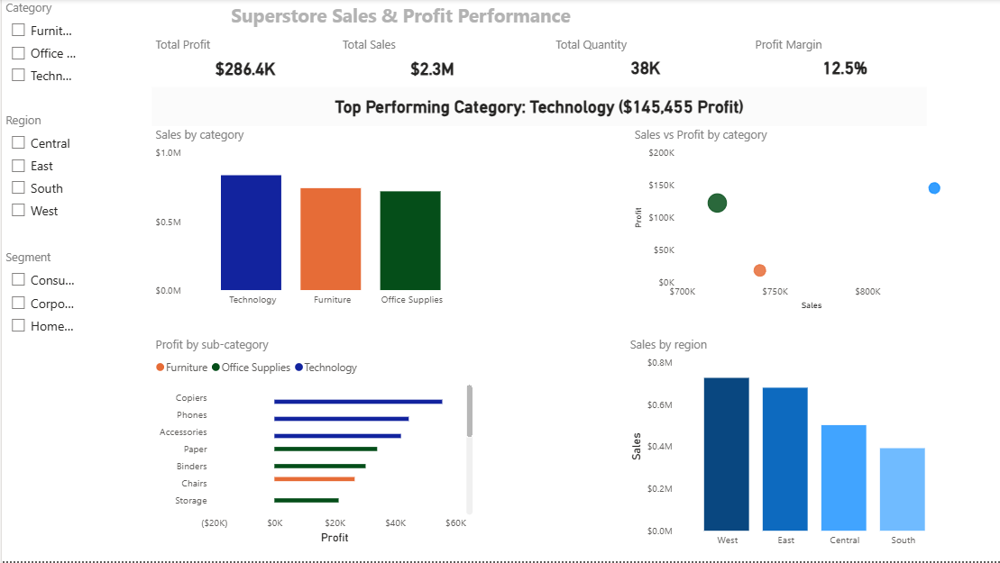

# Superstore Sales & Profit Performance Dashboard
## Dashboard Preview

## Overview

This project analyzes the Superstore dataset to evaluate overall sales performance, profitability, and regional contribution. The goal was to build a clean, executive-friendly dashboard that highlights key business insights using Power BI and DAX.

The focus was not just on visualizing numbers, but on summarizing performance in a way that supports decision-making.

---

## Key Metrics

- **Total Sales:** $2.3M  
- **Total Profit:** $286.4K  
- **Total Quantity Sold:** 38K units  
- **Profit Margin:** 12.5%

---

## Dashboard Highlights

- KPI cards summarizing overall performance
- Dynamic DAX measure highlighting the **top-performing category by profit**
- Sales vs Profit comparison by category
- Profit breakdown by sub-category to identify major contributors
- Regional sales comparison
- Interactive slicers for category, region, and segment filtering

---

## Key Insight

The dashboard dynamically identifies the highest performing category.  
For example:

> Top Performing Category: Technology ($145,455 Profit)

This insight updates automatically based on filters applied.

---

## Tools Used

- Power BI
- DAX (calculated measures)
- Basic data modeling within Power BI

---

## Purpose

This project demonstrates my ability to:

- Define and calculate business KPIs
- Build structured, executive-level dashboards
- Use DAX for dynamic insights
- Present data in a clear and decision-focused manner
